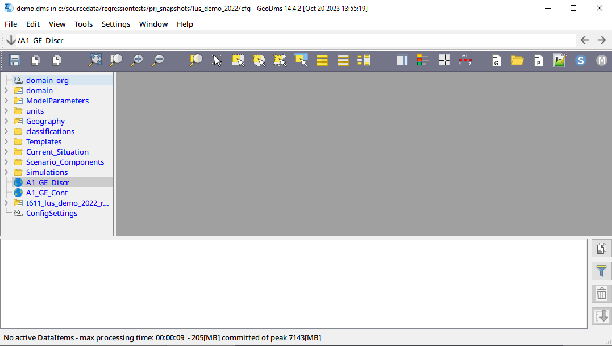
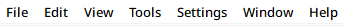
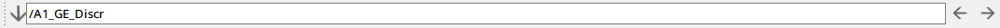
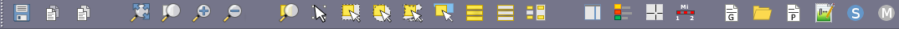
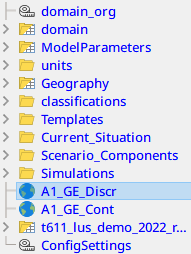
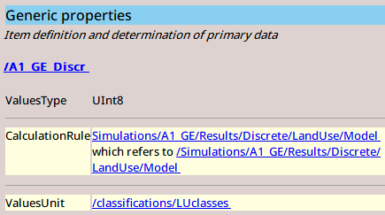
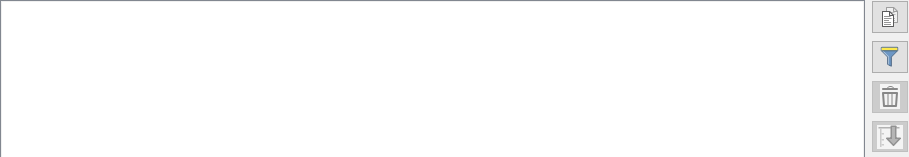
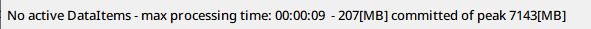

_[user-guide-geodms-gui](user-guide-geodms-gui)_ - desktop components

## desktop
After activating the application, the following window is presented:

In this main window the following components can be distinguished:

## titlebar

Titlebar with the opened configuration and GeoDMS version information

## main menu 

Menu bar with main menu options. For a description of all menu options, see section [main-menu](main-menu)

## addressbar

Address bar with the active item. The full name of an item can be copied to or from this address bar.

Use the buttons with the left/right arrows to the right to go to the next or previous items. The arrow button down at the left can be used to get a list of all visited tee items. 

## toolbar

Toolbar with view type specific tools (see [map-view](map-view) or [table-view](table-view) for a description) and the tools top activate a detailpage.  

## treeview

The treeview with the first level items expanded and the active item indicated. See the section [treeview](treeview) for more information. 

## detailpage

The Detail Pages are a set of tabs that present information on the selected Treeview item. These pages will be described in the section [detail-pages](detail-pages) 

## eventlog

This Eventlog provides progress information on reading, calculating or writing data and presents warnings and error. More information can be found in the [eventlog](eventlog) section.

## statusbar

The statusbar presents information on the number of items to be calculated, the memory usage and, if a map view is opened, the coordinates (X, Y and ZoomLevel) in the map.

## Fixed versus toggleable components

The titlebar, main menu and statusbar are always visible. The other components can be made invisible (and visible again) from the menu option > View or with an Alt _number_ keyboard combination.      

