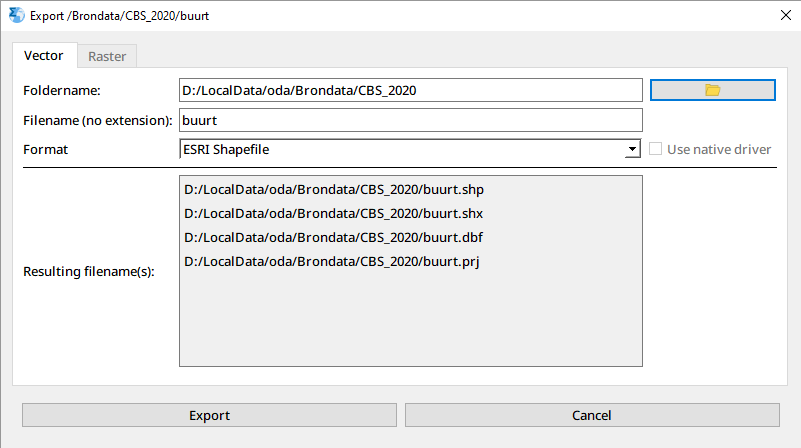

_[user-guide-geodms-gui](user-guide-geodms-gui)_ - export primary data

## activate export
Source data and model results can be exported to different formats. Select a [data-item](data-item) in the [treeview](treeview) and activate the menu option: _Export Primary Data_ on a data item or a [container](container) with direct data items.  

After activating the following dialog appears (in this case for a container with neighborhood data).

 

## Vector/Raster

The dialog has two tabs, Vector or Raster. Based on the [domain-unit](domain-unit) of the data items to be exported, a tab is presented:
- Vector for [one-dimensional-domain](one-dimensional-domain)
- Raster for [two-dimensional-domain](two-dimensional-domain) 

both tabs work in a similar way.

The following options can be set:
- **Foldername**: data is exported to one or multiple files, in the foldername set here. With the button a foldername can be selected or can be typed in the text box. By default the folder name is the name of your LocalDataDir [folders-and-placeholders](folders-and-placeholders) and the path of the item exported.
- **Filename (no extension)**: as for some formats (e.g. [esri-shapefile](esri-shapefile)), multiple actual files are written in an export, in this textbox the part of the filename can be set without the file extension. The actual files that will be written are presented in the _Resulting filename(s)_ box in the dialog.     
- **Format**: From a combobox a selection can be made for the format, based on the characteristics of the data. New formats can be added in the future.   
- **Use native driver**: for some formats, a native GeoDMS [storagemanager](storagemanager) and a [gdal](gdal) driver is available to export data. With this checkbox you can indicate if you want to use the native (checked) or GDAL (unchecked) driver. In some cases only one option is available and the setting can not be changed.

With the Export button the actual data is exported. 

 
