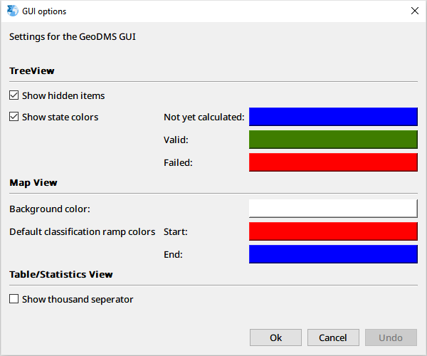

_[user-guide-geodms-gui](user-guide-geodms-gui)_ - GUI Options dialog

## dialog

The GUI Options dialog can be activated from the Settings main menu option.

The following options can be set:

**TreeView**
* **Show hidden items**: [tree-item](tree-item) can be configured to be hidden in the tree (by configuring the [property](property): _isHidden = "True"_). If so configured, the option Show hidden items shows or hide these items in the [treeview](treeview).
* **Show state colors**: By activating this option, colors are used in the TreeView to indicate the status of a tree item. Colors can be selected for the three mentioned statuses.

**Map View**
* **Background color**: The background color (by default white) for the [map-view](map-view) can be set here.
* **Default classification ramp colors**: for default classifications in the Map View, a color ramp is used for which a start and end color can be set.

**Table/Statistics View**
* **Show thousand separator**: A thousand separator in numbers can be set to make (large) numbers easier to read. 