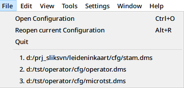
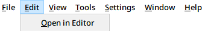
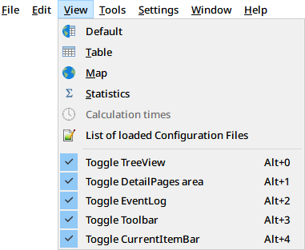
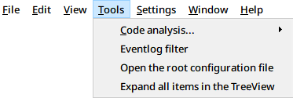
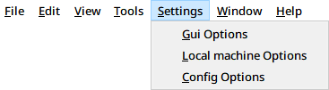
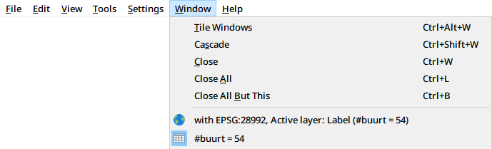
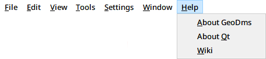

_[user-guide-geodms-gui](user-guide-geodms-gui)_ - main menu

## Introduction

The main menu is used for generic functions like opening a configuration or tiling the viewer windows or to active viewers for active [tree-item](tree-item)s.
In this page all the menu options are briefly described.

## File 

* **Open Configuration (Ctrl-O)**: Open a file dialog to select a new configuration. The current configuration is closed.
* **Reopen current Configuration (Alt-R)**: Reopen the current configuration with the same items expanded. 
* **Quit**: Exit the application. 

* **_Recent configurations_**: The recently opened configurations are presented as separate menu items. Select a configuration with the mouse or by pressing the number on the keyboard. The number of configurations in this list is not limited. With the right mouse click a pop-up menu can be activated with the following two options:
  - _pin_ (in the future it will become possible to pin a configuration, not yet implemented)
  - _remove_: removes the configuration from the the recent _Recent configurations_ menu options.      

## Edit

* **Open in Editor**: Open the current item in the [configuration-file-editor](configuration-file-editor) as configured in the Settings > Local machine options dialog, section Configuration File Editor. This option is also available from the pop-up menu of the [treeview](treeview).

## View

* **Default**: Activate the default viewer for the active [data-item](data-item) (the option is only enabled for data items). The default viewer for all data that can be visualized in a map is the map view. For all other data items, the default viewer is the Table view. The icon in the [treeview](treeview) indicates the default viewer.
* **Table**: Activate the [table-view](table-view) for the active data item. The option becomes enabled if the tree item can be visualized in a table.
* **Map**: Activate the [map-view](map-view) for the active data item. The option becomes enabled if the tree item can be visualized in a map.
* **Statistics**: Activate a Window with general statistics for the active data item. The option becomes enabled for data items. _The results in the Statistics view can differ slightly from calculated aggregated values. The Statistics view calculates all present values in a float64 format. If an aggregation is performed on a float32 data item, the results are round off after the calculations to a float32 format._
* **Calculation times**: Activate a Window with the calculation times and memory usage of the last task that took more than 1 second to complete. This option becomes enabled if such tasks are available.
* **List of loaded Configuration Files**: Activate a Window with the currently loaded configuration files, including their read data & time. 

* **Toggle _component_**: Toggles the component on or off. 

## Tools

* **Code analysis**: Four options to find out if the item configured is used in calculating results (This option is also available from the pop-up menu of the [treeview](treeview)):
  - _set source_: set the item as source item to be analysed
  - _set target_: set the item as target item for the calculation process 
  - _add target_: add the item as target item for the calculation process
  - _clear target_: clear the item as target item for the calculation process
* **Eventlog filter**: Activate the filter to select the [eventlog](eventlog) messages.
* **Open the root configuration file**: Opens the root item in the [configuration-file-editor](configuration-file-editor) as configured in the Settings > Local machine options dialog, section Configuration File Editor. This option is available here, as the root item can not be activated in the [treeview](treeview).
* **Expand all items in the treeview**: This options expand a full configuration in the TreeView (can be time consuming). The option is mainly relevant for debugging purposes.
 
## Settings

* **GUI Options**: Activate a dialog to [gui-options-dialog](gui-options-dialog).
* **Local machine Options**: Activate a dialog to [local-machine-options-dialog](local-machine-options-dialog).
* **Config Options**: Activate a dialog to [config-options-dialog](config-options-dialog) on the Local machine.

## Window

* **Tile Windows**: Tile the currently opened data viewers. The tab presentation is changed to the standard Windows visualization. The area for the primary data views is fully used by the viewers.     
* **Cascade**: Cascade the currently opened data viewers. The tab presentation is changed to the standard Windows visualization.
* **Close**: Close the active view.
* **Close all**: Close all currently opened data views.
* **Close all but this**: Close all opened data viewers except the currently active data view

* **_Views_**: All opened data views are presented as separate menu items. The active view is presented with a blue background color in the icon. Each view can be selected from this list.

## Help

* **About GeoDms**: Open the About GeoDms box for information on the GeoDMS version and the used components.
* **About Qt**: Opens the About Qt box for information on the Qt version used to develop the GUI
* **Wiki** : Opens the Wiki page of the GeoDms with documentation on how to use the GeoDMS
