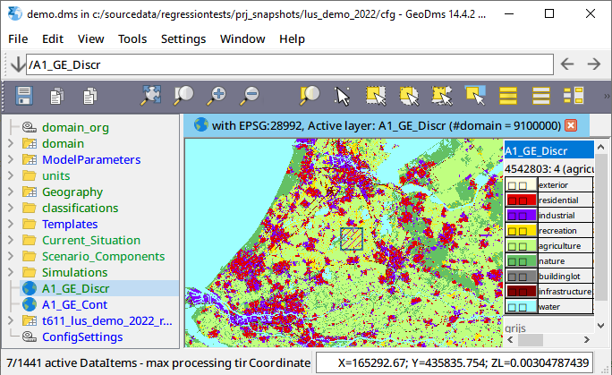

## introduction
This guide focuses mainly on the user, who views the primary data, calculates model results, initiates new cases and makes limited extensions and editions to the configuration. A detailed description of the structure of the client application, the different viewers and the composers are, therefore, described. This user guide does not contain sufficient information for modelers to set up a new configuration or a new calculation scheme. For this purpose, we refer to the section [how-to-model](how-to-model), describing the basics on how to configure a model with the GeoDMS.

The GeoDMS GUI is a Windows-based application. This user guide does not describe the generic Windows functionality like how to close, maximize or minimize a window. For more information on these topics refer to your Windows user guide. An Internet connection and installed browser are preferred, as the most actual help can be found at the above-mentioned website. 

## topics
- [desktop-components](desktop-components)
- [treeview](treeview)
- [main-menu](main-menu)
- [detail-pages](detail-pages)
- [map-view](map-view)
   - [map-view-layers](map-view-layers)
   - [map-view-tools](map-view-tools)
   - [map-view-legend](map-view-legend)
- [table-view](table-view)
- [valueinfo](valueinfo)
- [eventlog](eventlog)
- [classification-and-palette-editor](classification-and-palette-editor)
- [export-primary-data](export-primary-data)
- [gui-options-dialog](gui-options-dialog)
- [local-machine-options-dialog](local-machine-options-dialog)
- [config-options-dialog](config-options-dialog)
